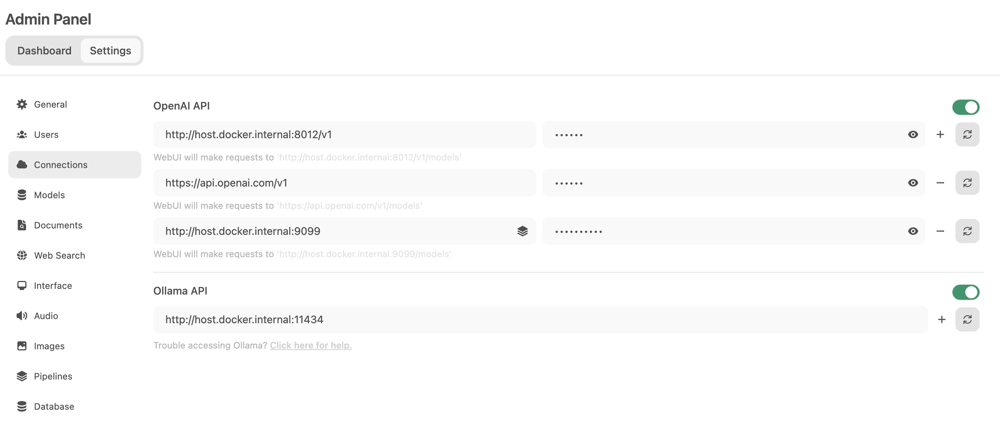
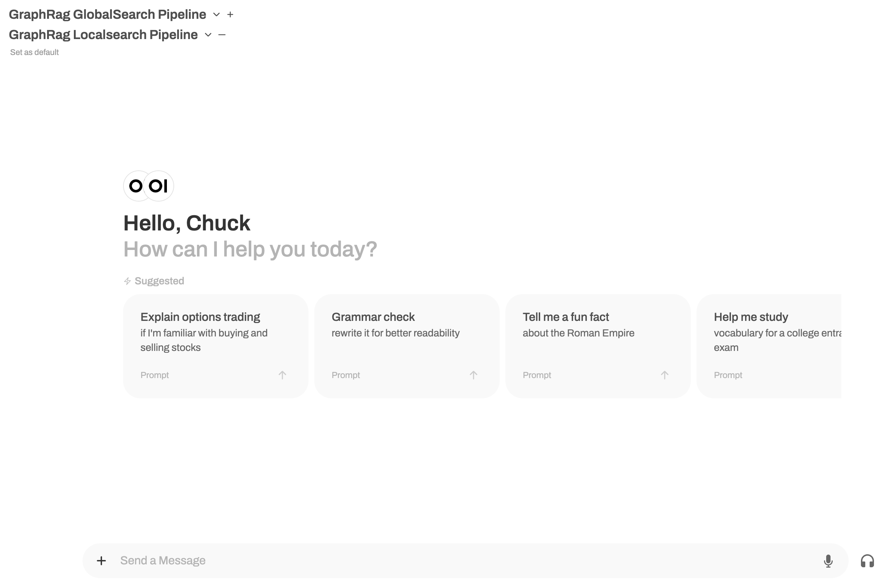

# TAMU-AI GraphRAG

GraphRAG is a powerful tool that allows you to build knowledge-graph retrieval-augmented generation (RAG) systems using large language models (LLMs). However, the original GraphRAG is designed for OpenAI models only. This project contains a modified version of Microsoft's GraphRAG that supports building knowledge graph retrieval-augmented generation (RAG) systems using open-source models like Qwen. This project integrates GraphRAG with Open-webUI, providing support for customized models deployed through Ollama via pipelines.

## Prerequisites

Ensure you have the following installed:

- **[Open-webUI](https://openwebui.com/)**: Web interface for model management and interaction
- **[Ollama](https://ollama.com/)**: For model deployment
- **Python 3.11+**: Project requires Python 3.11 or higher

## Installation Steps

### 1. Install Qwen2 Model

1. Download [qwen2-7b-instruct-q5_k_m.gguf](https://huggingface.co/Qwen/Qwen2-7B-Instruct-GGUF) from HuggingFace
2. Update the model path in `Modelfile-Qwen2-instruct`
3. Install using Ollama:

```bash
ollama install --model-file Modelfiles/Modelfile-Qwen2-instruct
```

### 2. Install GraphRAG

This is a modified version of GraphRAG that supports non-OpenAI models:

```bash
pip install -e ./Graphrag/graphrag
```

### 3. Install Embedding model

GraphRAG requires an embedding model. Install the embedding model in Ollama :

```bash
ollama pull nomic-embed-text
```

### 4. Build Knowledge Base

In a new terminal:

```bash
cd Graphrag/BuildGR

# Prepare input data
cp data/*.txt input

# Initialize graphrag index
python -m graphrag.index --init --root .

# Use example configuration
cp settings.yaml-example settings.yaml

# Build knowledge graph. This will take a while:
python -m graphrag.index --root .
```

### 5. Connect to Open-webUI with Pipeline

Use the Open-webUI pipeline, copy and rename the env-example file to the Open-webUI pipelines directory. Customize the .env file with your own API keys.

```bash
cp ./pipelines/.env-example <openwebui-pipelines-directory>/.env
```

Then copy 'graphrag_globalsearch_pipeline.py' and 'graphrag_localsearch_pipeline.py' to the pipelines folder under Open-webUI pipelines directory.

```bash
cp ./pipelines/pipelines/graphrag_globalsearch_pipeline.py <openwebui-pipelines-directory>/pipelines/
cp ./pipelines/pipelines/graphrag_localsearch_pipeline.py <openwebui-pipelines-directory>/pipelines/
```

When setting up pipelines, the OpenAI API in the admin settings should be configured by connecting to port '9099'.

The following is an example of the connection for Open-webUI running in the Docker container:



Then restart pipelines in the Open-webUI pipelines directory by running:

```bash
cd <openwebui-pipelines-directory>
sh ./start.sh
```

Once all set, you can select 'GraphRag GlobalSearch Pipeline' for a global search or 'GraphRag LocalSearch Pipeline' for localized searches.




## What's Next?

Additional features and improvements are under development. Stay tuned for future updates!

---

Created by [Chuck Zuo, Ph.D.](https://github.com/dkflameEDU) - Let's make TAMU-AI great together!
